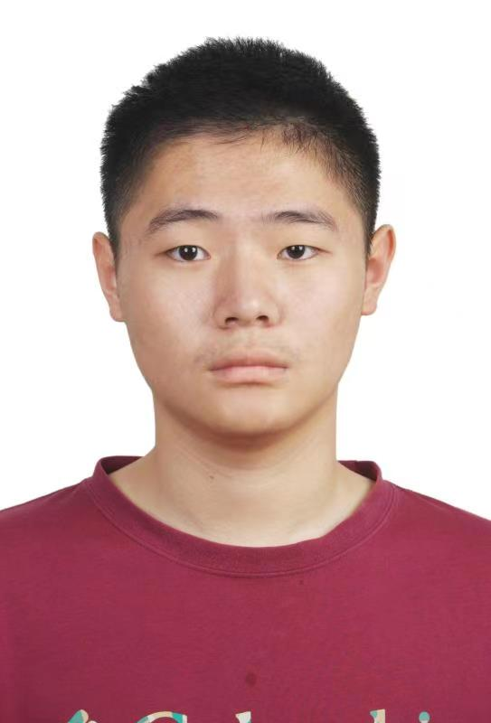

## About Me

I'm a PhD student in Beihang University where I focus on Robot Grasping and Scene Parsing.

## Publications
1.**H. Ma**, H. Yang, D. Huang, [Boundary Guided Context Aggregation for Semantic Segmentation](https://arxiv.org/abs/2110.14587),  British Machine Vision Conference 2021, [[paper](https://arxiv.org/abs/2110.14587), [code](https://github.com/mahaoxiang822/Boundary-Guided-Context-Aggregation)]